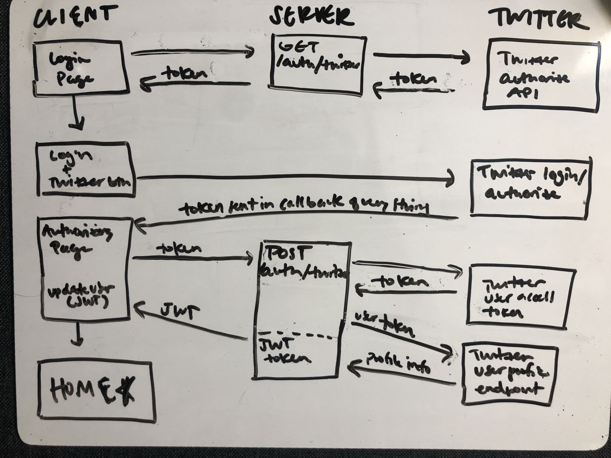

# SPACE FLEX

This is the server-side repository for Space Flex, where you can flex your space knowledge by learning about the astronauts in space and the current location of the International Space Station.

For client-side repository, and additional details on this project and its requirements, please visit the following link: [space-flex-client](https://github.com/kennansalisbury/space_client).

## Tech stack and dependencies/APIs used on the Front End
* Node.js
* Express
* Twitter API + Twitter-lite library to support
* JWT token for user data and sessions

## Back-End Routes
| Column Name | Data Type | Notes | 
| ------ | ------------ | --------------------------- |
| method | route | purpose/notes |
| GET | /auth/twitter | requests a token from twitter that is needed in order to request user authentication |
| POST | /auth/twitter | makes final request for user access token and then requests user profile information |
| GET | /twitter/user | searches for user profile by name |
|  *  | catch-all | returns "not found" message object |

## Twitter Authentication Flow
Built the following authentication flow after some trial and error, using twitter-lite dependency as support on the backend for signing and sending requests to Twitter.

1. On load, front-end login screen posts GET to /auth/twitter route
2. /auth/twitter GET route posts request to Twitter for the request token needed prior to authentication requests
3. Twitter returns the request token to the server
4. The server sends the authentication redirect link w/ token appended as query string
5. Front-end login page now displays "Sign in with Twitter" button which links to the redirect provided from the server.
6. When user clicks on button, they are redirected to login to Twitter and authorize Space Flex.
7. Once authorized, user is redirected to an "authorizing" loading page with token information appended as a query string
8. Client parses query string and posts token info to /auth/twitter server route.
9. Server requests final user access token needed from Twitter API, and then uses this token to post another request to the Twitter API for the user's full profile information
10. The full profile data is signed to a JWT token, which is then sent back to the front-end and the user is logged in/redirected to the home screen.
